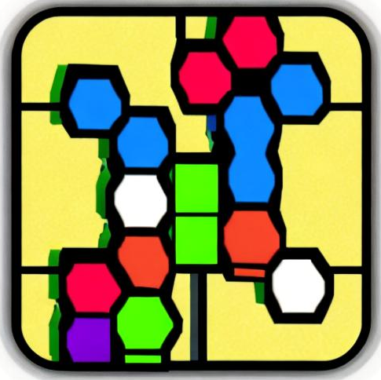
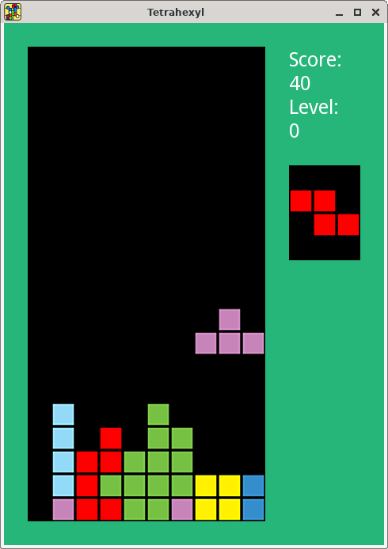

# tetrahexyl 
Tetris clone using the SFML library in C++.

## Features
* Essentially what the NES version of the game gives you
* The UI could use some work

## Building
Install the sfml development libraries, and run `make`. Only tested on Linux.

